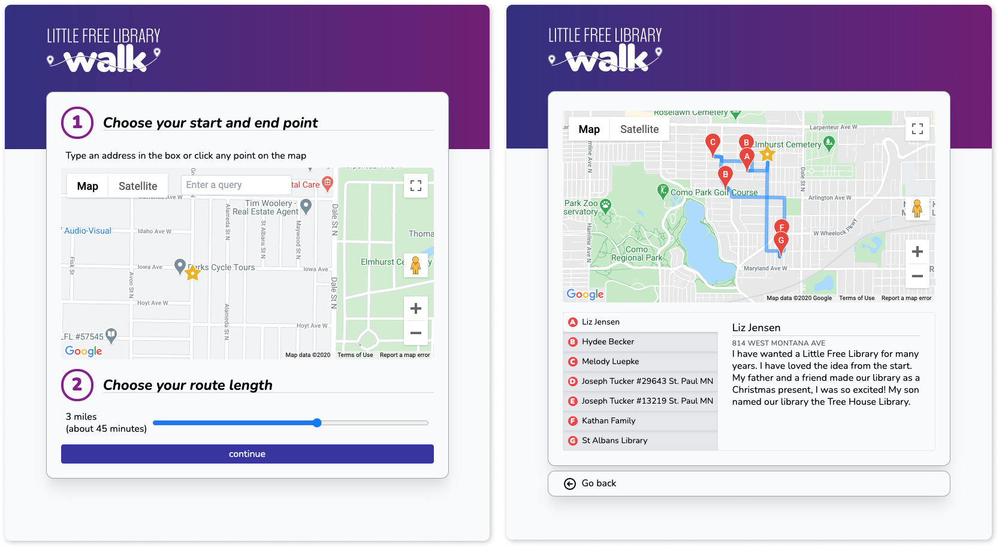

# Little Free Library Walk

Using data from the [Little Free Library Organization](https://littlefreelibrary.org/ourmap/), Little Free Library Walk shows users a walking route to take based on locations of libraries near them. Tapping on each library in the list provides more information.

## Tech stack
- **Frontend**: Svelte, Google Maps API (Maps, Directions). Hosted on Netlify.
- **Backend**: Node.js, express, Google Maps API (Distance Matrix, Reverse Geocoding), Redis. Hosted on Heroku. 
